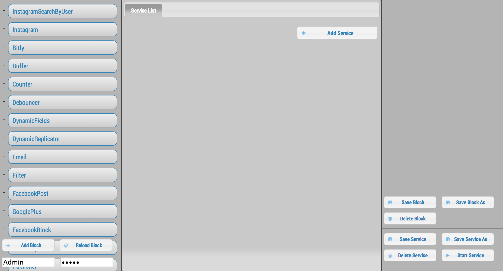
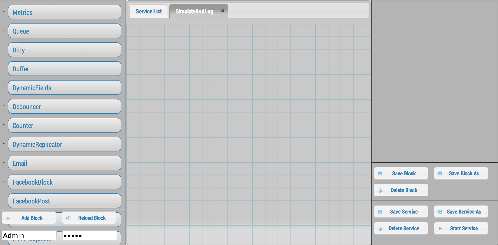
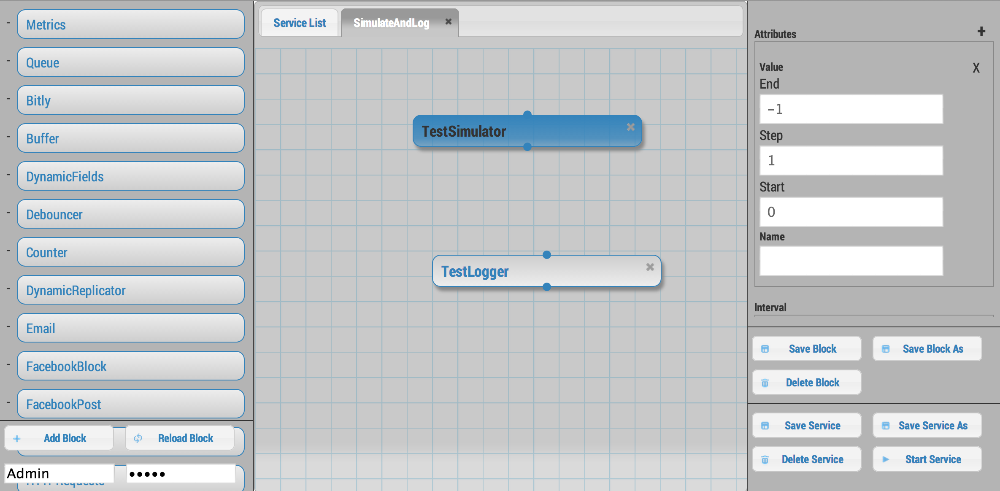
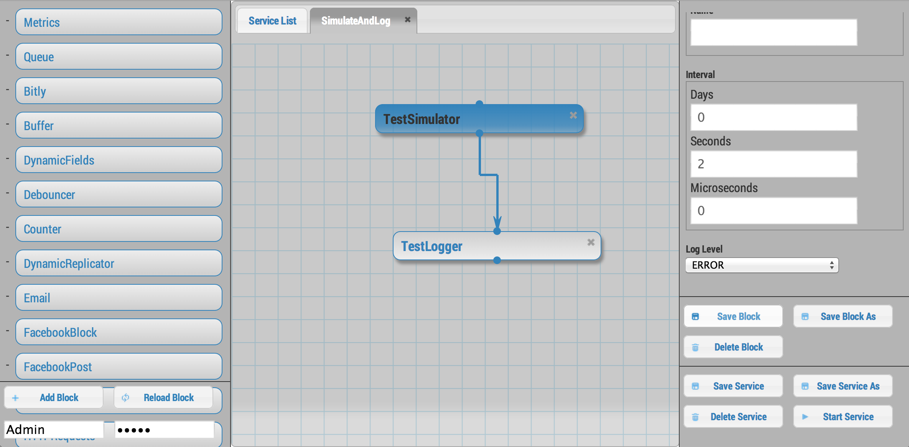

Getting Started
===============

.. _requirements:

Requirements
------------

* `Python 3.4 or greater <https://www.python.org/download/>`_
* `pip <https://pip.pypa.io/en/latest/installing.html>`_
* `virtualenv <http://docs.python-guide.org/en/latest/dev/virtualenvs/>`_
* `git <http://git-scm.com/download>`_

First, open a terminal in your home directory and check that you have everything you need.

For Windows
    run these commands in a **Git Bash** Terminal. To access this,
    make sure you select "Git Bash Here" when installing git. Then go to any folder and 
    ``right click`` -> ``Git Bash Here``

    Also, pay attention to the **For Windows** notes

.. code-block:: bash

    python3 --version
    pip3.4 --version
    virutalenv --version
    git --version

If those four commands don't return anything, follow the requirement links at the top before continuing.

For Windows
    Sometimes the windows installation can be a pain. For help see [this link](https://docs.python.org/3.4/using/windows.html).
    In the simplest case, you simply have to do the following:

    - Install Python3.4 for Windows from the link at the top of this page
    - Go to ``Control Panel`` -> ``System`` -> ``Advanced System Settings`` -> ``Environment Variables``
        - In ``System variables`` select ``Path`` and hit ``Edit``
        - **Append** (do not delete any text that exists) the following text: ``C:\Python34;C:\Python34\Scripts;``
        - hit ``OK`` until out of all configuration windows
    - Create a ``python3`` shortcut to work with the rest of this tutorial. You may 
        be able to skip this and just use ``python`` instead of ``python3`` for the rest of this tutorial
    - Open ``cmd`` in Administrator Mode (``Windows Key`` -> type ``cmd`` -> right click ``cmd`` -> ``Open in Administrator Mode``
    - type: ``cd C:\Python34``
    - type: ``mklink python3.exe python.exe``

System Setup
------------

As a standard, we will be installing each version of nio to its own virtual environment. This keeps nio and all its dependencies isolated from other python projects and environments you may already have on your machine. You can read more about them `here <http://docs.python-guide.org/en/latest/dev/virtualenvs/>`_.

Each nio project will be in its own directory too. We will start by creating some directories for these.

.. code-block:: bash

    cd ~
    mkdir nio
    cd nio
    mkdir projects
    mkdir versions

Installation
------------

Lets start by installing nio version 1.5.1.

.. code-block:: bash

    cd ~/versions
    virtualenv -p python3 1.5.1

For Windows
    The last command will be: ``virtualenv -p C:/Python34/python.exe 1.5.1``

You now need to activate your virtual environment. This will add a `(1.5.1)` to the beginning of your command line to indicate the virtual environment that you are using.

.. code-block:: bash

    source 1.5.1/bin/activate

For Windows
    The last command will be: ``source 1.5.1/Scripts/activate``

When you're done using nio, you can leave the virtual environment with `deactivate`. When using nio again, be sure to activate the virtual environment first with `source ~/nio/versions/1.5.1/bin/activate`.

OK, now we can finally install `nio <http://n.io/versions/nio/>`.

.. code-block:: bash

    pip install http://n.io/versions/nio/nio-1.5.1-py3-none-any.whl
    pip install http://n.io/versions/nioext/nioext-1.5.1-py3-none-any.whl

For Windows
    pywin32 must also be installed: ``easy_install http://sourceforge.net/projects/pywin32/files/pywin32/Build%20219/pywin32-219.win-amd64-py3.4.exe/download``

The installation of nio is now complete! You can run the instance from a project directory with the ``run_nio`` command. See :ref:`setting-up-a-project` for instructions on creating a project directory.

We now install a tool that helps with common operations like creating projects, adding blocks and managing dependencies. It is called the nio Command Line Interface (CLI).

.. code-block:: bash

    pip install https://github.com/neutralio/nio-cli/archive/master.zip

.. _setting-up-a-project:

Setting up a NIO Project
------------------------

To use the nio CLI you need `git` (a distributed version control tool) and a `GitHub account <http://github.com>` with `ssh access <https://help.github.com/articles/generating-ssh-keys>`.

To help you get started, we provide a `project template <https://github.com/nio-blocks/project_template>` which reflects the standard directory structure of a nio project. Use the nio CLI to create a new project from the template.

Verify that you can connect to git with: `ssh git@github.com`. It should return something like "Hi YOUR_USER_NAME! You've successfully authenticated, but GitHub does not provide shell access."

For Windows
    If you have having trouble connecing, type this and try again: ``eval $(ssh-agent -s) && ssh-add ~/.ssh/id_rsa``

.. code-block:: bash

    cd ~/nio/projects
    nio new getting_started
    cd getting_started

If you don't have ssh access set up for GitHub then try using the https flags:

.. code-block:: bash

    nio new getting_started --https
    
The first thing we're going to need is some blocks. We provide a selection of `open source blocks <https://github.com/nio-blocks>` for your convenience, but, remember, nio is designed to make it easy for you to develop custom blocks; more on this later. For now, let's just get a group of blocks that we've categorized as *util*.

.. code-block:: bash

    nio add util

Again, if you don't have ssh access set up for GitHub then try using the https flags:

.. code-block:: bash

    nio add util --https

Running nio
~~~~~~~~~~~

This part is simple. With the virtual environment active (which it should already be if you've been following along), run the following command from the root of your project directory (which should also already be ready if you've been following along):

.. code-block:: bash

    cd ~/nio/projects/getting_started
    run_nio

It is common to see many INFO log messages. If you see any ERROR messages you may have a problem. But for now lets ignore this one: `NIO [ERROR] [Discover] Failure loading module nioext.components.snmp.agent ImportError:No module named 'pysnmp'`. We won't be using that anyway.

At this point we're done running commands from the terminal, but we will be keeping an eye on these logs.

(Later, when you're done, you'll want to press ctrl-c to exit nio).

Creating your first service
~~~~~~~~~~~~~~~~~~~~~~~~~~~

nio has a web app that you can use to interact with a running nio instance. By default, the `project_template` runs on **127.0.0.1:8181**, so just visit <http://builder.n.io> and log in with the default administrator priviledges (username: Admin; password: Admin). You should see something like this:

.. code-block:: bash

    open http://builder.n.io

To demonstrate the most basic use of the web UI, we'll design a service that generates nio signals automatically and logs them to the nio logging. With the way the `project template` is configured, this means we will see the simulated signals logged to the console and to a log file for our service.

First, click the **Add Service** button that appears in the top-right corner of the center panel of the web UI. Let's name the service `SimulateAndLog`. When you're done entering the service name, click **Submit**. At this point, your browser window should look something like this:

Now we can add a few blocks. The list in the left panel of the UI contains the list of block types currently loaded into nio. Scroll until you find the **Simulator**; click and drag it over to the `SimulateAndLog` grid. Name it `TestSimulator` and click **Submit**. In the left panel, again, scroll to find the **LoggerBlock**, and drag it over to the grid. Name it `TestLogger`.

Click **Save Service** in the bottom right of the right panel (you should get a confirmation that the save was successful).

Click the **Start Service** button in the very bottom right of the UI, and watch the terminal where you executed **run_nio**.

You should see a bunch of log messages with information about starting and configuring the service, but no signals get logged! This is because we didn't connect the blocks in `SimulateAndLog`. Nio blocks can run in isolation until the cows come home, but they won't communicate with each other until we explicitly connect them. Lets fix that.

First, stop the service (changes to a running service won't be reflected in its behavior until it is restarted anyway). Next, connect `TestSimulator` to `TestLogger`. Click and drag from the dot on the underside of `TestSimulator` to the dot on top of `TestLogger`.

Click **Save Service** and **Start Service** again. This time you should see signals logged to the console every second (check the timestamps).

Congratulations! You just built your first nio service!

Configuring blocks
~~~~~~~~~~~~~~~~~~

Lets try changing our service by configuring the blocks to something other than the default behavior.

Click on the `TestSimulator` block to bring up its configuration in the right panel. Don't worry too much about specific properties here. To get familiar though, scroll down to the `Interval` section and change the number in the `Seconds` text box from 1 to 2; click **Save Block**. Now select `TestLogger` in the execution grid and use the drop-down menu to change its `Log Level` and `Log At` to *DEBUG*, saving the block when you're done. 

Restart your service by clicking **Stop Service** and **Start Service**. This time you should see signals logged to the console every 2 seconds (check the timestamps).

Conclusion
~~~~~~~~~~

Now that you've got a nio project with some blocks, try playing around with some of the other blocks. Change some more configuration settings on `TestLogger`. What does `Signal Count do`?. Try putting a **Counter** between a **Simulator** and a **Logger**. All the blocks have `documentation on GitHub <https://github.com/nio-blocks/util>`_.

When you're done with nio, go to the console where your logs are printing and press ctrl-c to exit nio.
